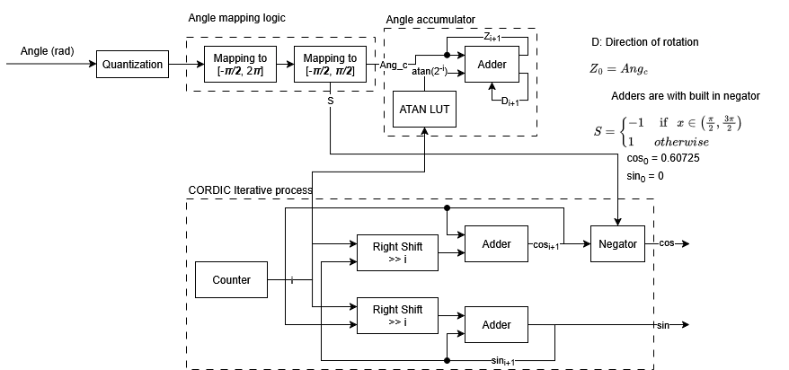

# 32-bit Fixed-point CORDIC for sine/cosine computation
## Features
- Modeled in MATLAB Fixed-Point Designer to generate the arctan LUT and reference outputs.
- Verified against MATLAB reference outputs.
- Max error of ≈1.8×10^(-4) and synthesized in Xilinx Vivado.
- Implemented standalone C and RISC-V assembly versions of the algorithm. [Link](https://github.com/mm-hashem/cordic)

## MATLAB BLOCK DIGARAM

